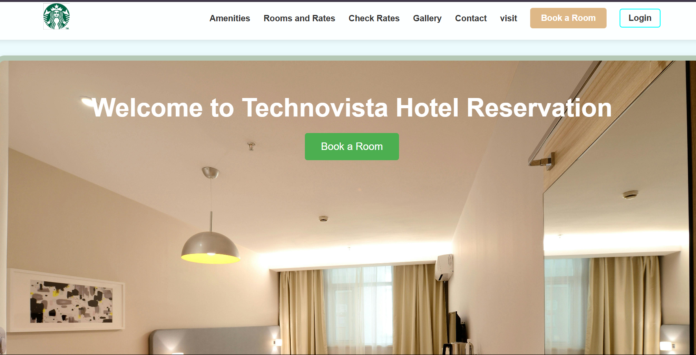

# 🏨 Technovista Hotel Online Reservation System



✨ **A modern hotel booking platform with M-Pesa integration** ✨  
*Developed during our school's internal attachment program*

---

## 🌟 About The Project

Technovista is not just another booking system - it's a **complete digital solution** for hotels to manage reservations, showcase their offerings, and accept secure mobile payments. Built with Django and integrated with Safaricom's Daraja API, this platform brings hotel management into the digital age.

### Why Technovista?
- ✅ **End-to-end booking experience**
- ✅ **Secure M-Pesa payments**
- ✅ **User-friendly interface**
- ✅ **Scalable architecture**

---

## 🚀 Features

### 💻 Core Functionality
| Feature | Description |
|---------|-------------|
| 🛏️ Room Booking | Intuitive reservation system with real-time availability |
| 💳 M-Pesa Integration | Secure payments via Safaricom's Daraja API |
| 🔐 User Accounts | Guest registration and authentication |
| 📊 Dynamic Pricing | Seasonal rates and special offers |

### 🖼️ Content Presentation
| Feature | Description |
|---------|-------------|
| 🏆 Amenities Showcase | Beautiful display of hotel facilities |
| 📸 Photo Gallery | Visual tour of rooms and common areas |
| 📍 Visit Information | Easy-to-find location details |
| 📞 Contact System | Multiple ways to reach the hotel |

---

## 🛠 Tech Stack

**Backend Power:**
- 🐍 Python 3.x
- ⚡ Django 4.x
- 🔄 Django ORM
- 💰 Daraja API (M-Pesa)

**Frontend Magic:**
- 🌈 HTML5
- 🎨 CSS3
- ✨ JavaScript

**Database:**
- 🗃️ SQLite (Development)
- 🏗️ PostgreSQL (Production-ready)

---

## 📱 Current Limitations

❗ **Note:** While feature-complete, there are some areas we're improving:
- 📱 Mobile responsiveness (Coming soon!)

---

## 🏁 Getting Started

### Prerequisites
- Python 3.8+
- Pip package manager
- [Daraja API credentials](https://developer.safaricom.co.ke)

### 🛠 Installation Guide

```bash
# 1. Clone the repository
git clone https://github.com/yourusername/technovista-reservation.git
cd technovista-reservation

# 2. Set up virtual environment
python -m venv venv
source venv/bin/activate  # Linux/Mac
.\venv\Scripts\activate  # Windows

# 3. Install dependencies
pip install -r requirements.txt

# 4. Configure environment
echo "DARAJA_CONSUMER_KEY=your_key" > .env
echo "DARAJA_CONSUMER_SECRET=your_secret" >> .env
echo "DARAJA_SHORTCODE=your_code" >> .env

# 5. Run migrations
python manage.py migrate

# 6. Start development server
python manage.py runserver
